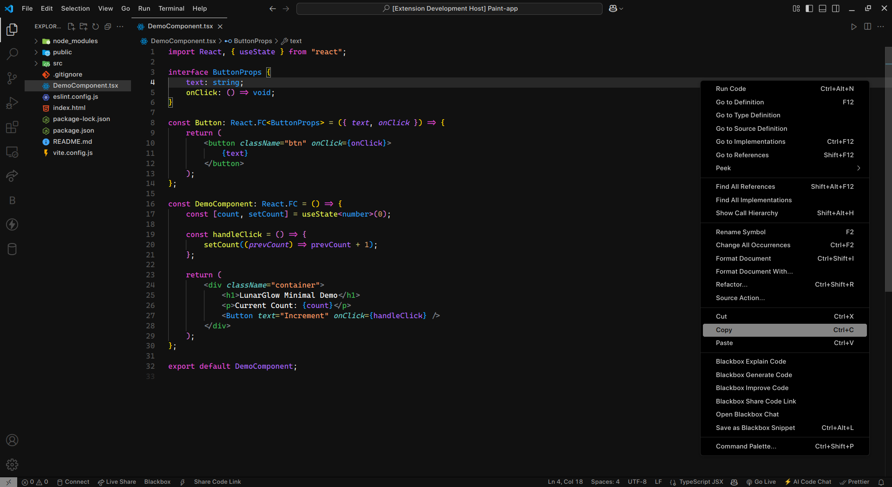

# LunarGlow Minimal - VS Code Theme

LunarGlow Minimal is a sleek, modern, and minimalistic dark theme for Visual Studio Code. It features a subtle contrast between soft grayish-white buttons and a deep dark background, ensuring a comfortable coding experience without excessive strain on the eyes.

## ✨ Features
- **Minimalistic UI** - Clean, clutter-free design for focused coding.
- **Greyish-White Buttons** - Ensures visibility without harsh contrasts.
- **Dark Mode Aesthetic** - Perfectly balanced contrast for extended use.
- **Optimized for Readability** - Carefully selected colors to enhance readability without distractions.
- **Consistent Syntax Highlighting** - Maintains a balanced color scheme across different file types.

## 📸 Screenshots
  
*Experience the elegance of LunarGlow Minimal in VS Code.*

## 🔧 Installation
1. Open **Visual Studio Code**
2. Go to **Extensions** (`Ctrl + Shift + X`)
3. Search for **LunarGlow Minimal**
4. Click **Install**
5. Open **Command Palette** (`Ctrl + Shift + P`) and type `Preferences: Color Theme`
6. Select **LunarGlow Minimal**

## 🚀 Recommended Settings
For the best experience, consider enabling the following settings:
```json
{
    "editor.fontFamily": "Cascadia Code, Consolas, 'Courier New', monospace",
    "editor.fontLigatures": true,
    "editor.cursorBlinking": "smooth",
    "workbench.iconTheme": "material-icon-theme"
}
```

## 🛠 Contributing
Feel free to suggest improvements or report issues via GitHub.

<!-- ## 📜 License
This theme is released under the [MIT License](LICENSE). -->

Enjoy coding with **LunarGlow Minimal**! 🚀

